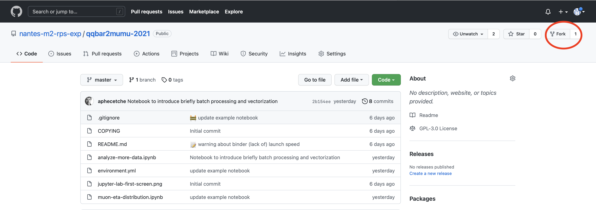
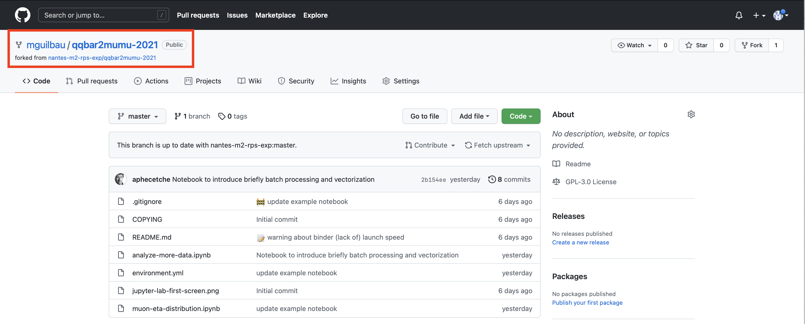
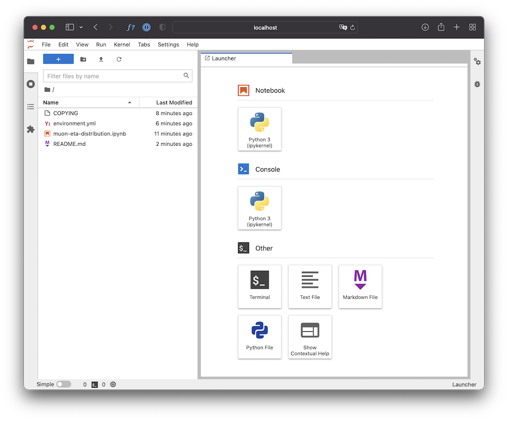

:warning: | WIP - ne pas utiliser avant la première scéance | :bangbang:
:---: | :---: | :---:

# Projet expérimental - Production de quarkonia

> Ce dépot git héberge les fichiers nécessaires pour démarrer le projet "Production de quarkonia" du Master 2 RPS de l'Université de Nantes. Il est principalement à destination des étudiants qui réalisent ce projet. Le "vous" ci-dessous s'adresse donc à ces étudiants.

Pour ce projet le language de programmation choisi est Python. Nous recommandons de l'utiliser par le biais de ["Notebooks Jupyter"](https://jupyter.org) qui permettent de mélanger le code, la documentation et les résultats de l'exécution du code.  

Jupyter est un outil commun dans le domaine de la science des données. Il y a bien des façons d'utiliser Jupyter et de nombreux tutoriels sont disponibles en ligne pour aller plus loin, mais vous trouverez ci-dessous deux méthodes pour démarrer : une méthode locale et une méthode "cloud".

## Téléchargement du paquet
> Si vous êtes capable de lire cette documentation, vous avez déjà un compte sur GitHub! Il s'agit bien évidemment d'un pré-requis pour le projet. Si ce n'est pas le cas, il faut passer par l'[installation de git](https://git-scm.com/book/en/v2/Getting-Started-Installing-Git) sur votre machine. Dans la suite, nous tentons de vous fournir les commandes de base pour démarrer avec Git. Cependant, un nombre important de ressources documentaires et tutoriels sont disponibles sur le net pour approfondir votre maîtrise de l'outil.

Utiliser la commande git suivante :

```shell
git clone https://github.com/nantes-m2-rps-exp/qqbar2mumu-2021.git
``` 

Par défault, vous êtes sur la "master branch" du projet "origin". Pour pouvoir travailler sur le projet, vous devez effectuer un "Fork" de celui-ci en cliquant sur le bouton en haut à droite :



Une fois le "Fork" réalisé, vous êtes en possession d'une copie complète du projet sur laquelle vous pouvez travailler :



Par la suite, l'adresse de votre projet sur Github (*https://github.com/"YOUR_GIT_USER_NAME"/qqbar2mumu-2021.git*) sera référencée par *myrepo*.
En local sur votre machine, il faut maintenant accéder à cette copie. Pour cela, vous devez utiliser les commandes suivantes :

```shell
git remote add myremote myrepo
git fetch myrepo
```

Ces deux commandes vous permettront de connecter votre environnement de travail local (votre machine) avec votre copie en ligne du projet (remote dont vous avez effectué "Fork").
Pour lister les "remote" disponibles, vous pouvez utiliser la commande :

```shell
git remote -v
```

Lors du développement, il est FORTEMENT conseillé de ne pas travailler sur la branche "master" de votre "Fork" mais de créer une nouvelle branche par tâche.
Pour créer une branche, vous pouvez utiliser la commande suivante :

```shell
git checkout -b "YOUR_BRANCH_NAME"
```

Vous êtes alors automatiquement positionné sur votre branche. Il est conseillé de choisir un nom de branche permettant d'identifier le créateur et contenant une indication sur la tâche que vous souhaitez réaliser sur cette branche. Par exemple un nom de branche pourrait être "guilbaud_distmasseinvariante". Pour lister les branches disponibles :

```shell
git branch 
```

Pour changer de branche :

```shell
git checkout "BRANCH_NAME" 
```

Vous pouvez maintenant commencer à travailler. Pour sauvegarder en local les changements sur vos fichiers, il faut utiliser les commandes :

```shell
git add "FICHIER-X" "FICHIER-Y" FICHIER-Z"
git commit -m "your message that explains what you have changed" 
```

Pour savoir quels fichiers ont été modifiés et ne sont pas encore sauvegardés par un commit :

```shell
git status
```

Il est important de faire des "commit" le plus régulièrement possible. Cela permet de sauvegarder tout vos changements, de revenir en arrière, etc. Lorsque vous êtes satisfait de votre avancée et à intervalle plus ou moins régulier, vous pouvez envoyer votre code sur votre remote.

Pour cela :

```shell
git push myremote
``` 

Une fois la tâche terminée, vous pouvez fusionner votre branche avec la "master" branche (en rajoutant vos commits "au-dessus" de master) : 

```shell
git checkout master
git pull --rebase
git checkout "YOUR_BRANCH_NAME"
git rebase master
git push myrepo
```

Enfin, pour intégrer vos changements au "master" project qqbar2mumu, il vous faudra faire une "pull request" en ligne.

## Installation locale (recommandée)

Si possible, essayez d'installer Jupyter sur votre ordinateur (portable), car cela offre plus de souplesse (et potentiellement de performance).

Même si ce n'est pas la seule façon d'installation Jupyter et les dépendences nécessaires à ce projet (ou tout autre projet à base de Python), nous conseillons le recours à [conda](https://docs.conda.io), en particulier via sa version [miniforge](https://github.com/conda-forge/miniforge/#download).

### Installation de miniforge (conda)

Récupérer le [script d'installation](https://github.com/conda-forge/miniforge/#download) correspondant à votre plateforme et exécutez-le. Par exemple sous Linux : 

```shell
bash Miniforge3-Linux-x86_64.sh
```

Suivez les instructions (en résumé : ENTER - SPACE - yes - ENTER - yes). 

A l'issue de cette étape la commande `conda` est maintenant disponible (vous devrez peut-être vous déconnecter et reconnecter pour la voir).

```shell
conda help
```

### Installation des paquets de base avec conda

Ce dépot contient un fichier [`environment.yml`](environment.yml) qui décrit les dépendences utilisées par le notebook d'exemple (`muon-eta-distribution.ipynb`) que vous utiliserez pour vous mettre dans le bain.

Avec conda (et plus généralement avec Python) il est très fortement recommandé de travailler dans un "environnement" (qui décrit un ensemble de modules Python et leurs versions respectives). Pour ce faire il faut installer l'environnement (une seule fois) :

```shell
conda env create
```

puis l'activer pour l'utiliser (à chaque connection/déconnection).

```shell
conda activate qqbar2mumu
```

Une fois l'environment activé, vous pouvez lancer Jupyter lab


```shell
jupyter lab
```

Ce qui lance une application web dans votre navigateur : 



Double-cliquez sur `muon-eta-distribution.ipynb` dans le panneau de gauche et vous êtes prêts à démarrer !
Pensez à sauvgarder vos changements le plus souvant possible. Pour quitter le notebook, il suffit de faire "Fichier/LogOut".


## Installation cloud 

Si vous ne trouvez vraiment aucun ordinateur sur lequel installer le projet, vous pouvez essayer de travailler directement en ligne. Il existe [plusieurs services](https://www.dataschool.io/cloud-services-for-jupyter-notebook/) en ligne qui offrent la possibilité d'exécuter des notebooks Jupyter. 

A titre d'exemple, le badge suivant devrait vous permettre d'ouvrir le notebook d'example dans un de ces sites, Binder. Attention : le démarrage peut être très lent, il faut être patient...

[](https://mybinder.org/v2/gh/nantes-m2-rps-exp/qqbar2mumu-2021/HEAD)


